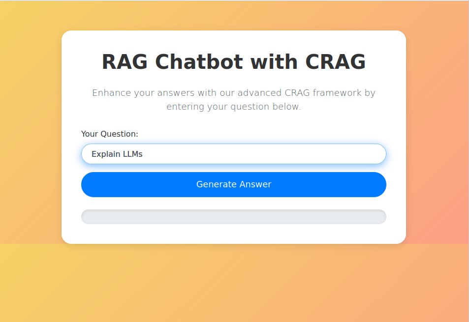
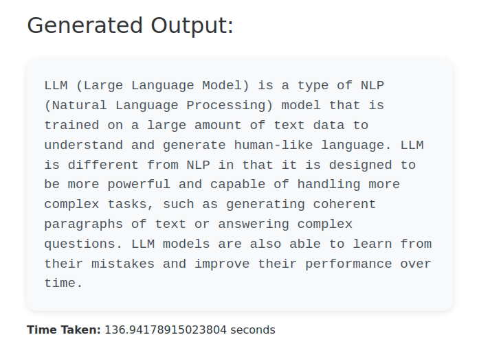

# Powerful RAG Chatbot with Corrective Retrieval and Local LLMs

## Overview

This project features a Corrective Retrieval Augmented Generation (CRAG) framework designed to enhance chatbot accuracy. The framework integrates LangGraph, local Large Language Models (LLMs), and corrective retrieval actions. By implementing document grading and triggering web searches, it improves information reliability and relevance.

## Features

- **CRAG Framework**: Combines LangGraph and local LLMs to deliver more accurate and reliable chatbot responses.
- **Corrective Retrieval**: Utilizes corrective retrieval actions to enhance response quality and correctness.
- **Document Grading**: Assesses document relevance to determine if a web search is needed for accurate knowledge supplementation.
- **Web Search Integration**: Triggers web searches to supplement and verify information, ensuring up-to-date and accurate responses.

## Files

- `main.py`: Main entry point for the application.
- `lang.py`: Contains the core functionality for setting up and running the LangChain agent.

## Screenshots

